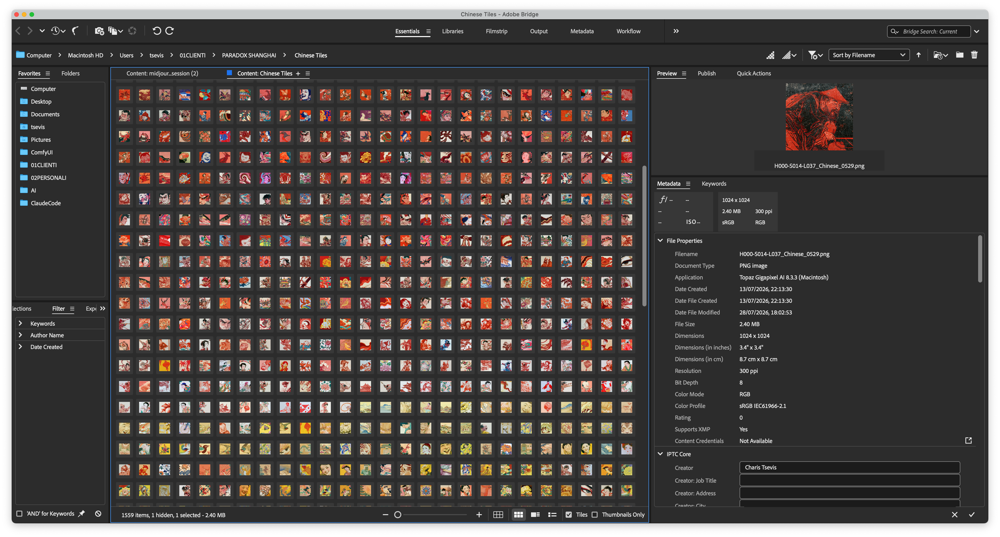
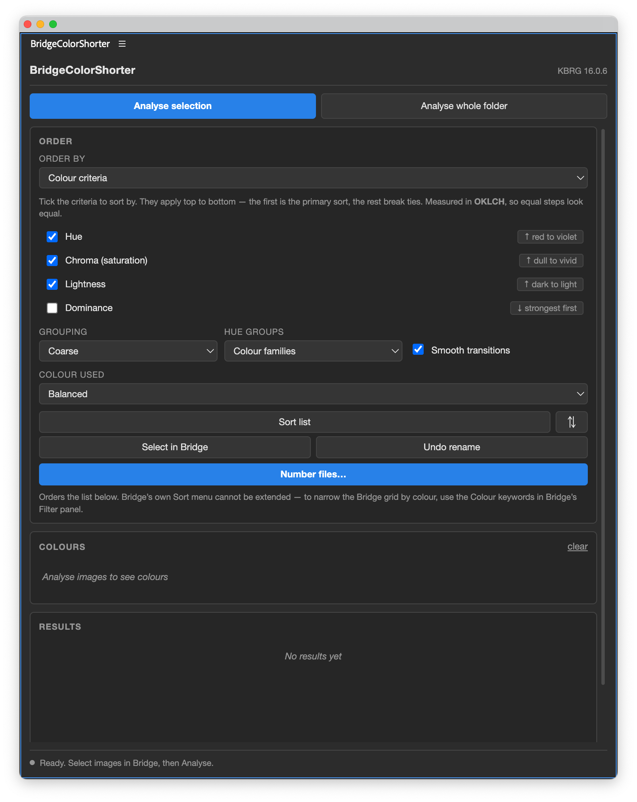

# BridgeColorShorter

**Sort a folder of images by colour, inside Adobe Bridge.**

Point it at a folder, press one button, and the grid rearranges itself so that
reds sit with reds, golds with golds, and each block runs smoothly from dark to
light. It is built for people with thousands of images and no way to see the
shape of what they have.



*1,559 images, sorted. Bridge is on **Sort by Filename** — the order lives in
the filenames, because that is the only ordering Bridge lets you control. Reds
ramp dark to light, then hand over to the golds.*

---

## Contents

- [What it does](#what-it-does)
- [The problem, and why it is harder than it looks](#the-problem-and-why-it-is-harder-than-it-looks)
- [The reasoning](#the-reasoning)
- [User's guide](#users-guide)
- [Installing](#installing)
- [How fast it is](#how-fast-it-is)
- [What Adobe Bridge will not let you do](#what-adobe-bridge-will-not-let-you-do)
- [For developers](#for-developers)

---

## What it does

1. Reads every image in the folder Bridge is showing.
2. Decodes each one and finds its palette — the handful of colours it is
   actually made of, and how much of the frame each one occupies.
3. Orders the images so that colour flows: one block per colour family, each
   block ramping from dark to light.
4. Writes that order into the filenames as a short prefix, so **Bridge's own
   grid** shows it. Sort by Filename and the folder is in colour order.
5. Stores the palette inside each file as XMP, so the next run takes seconds
   instead of minutes.

Undo restores every original filename exactly.

---

## The problem, and why it is harder than it looks

"Sort these by colour" sounds like a one-line job. Sort by hue. It is not, and
every obvious approach fails in a way you can see the moment you look at a
contact sheet.

**A photograph is not one colour.** Two tiles can share a dominant red and look
nothing alike, because one carries gold and cream and the other carries blue and
white. Flattening an image to a single number throws away four fifths of what
made it distinctive.

**Hue is a circle, and lists are lines.** Any ordering has to cut the circle
somewhere, and wherever you cut it, two similar colours end up at opposite ends.

**Hue is meaningless for greys.** A near-neutral has a hue, technically, and it
is numerical noise. Sort by it and your greys scatter randomly through the reds.

**Adobe Bridge will not sort by anything you invent.** Its Sort menu is a fixed
list. There is no plugin API for adding a criterion.

Each of those has a specific answer below. None were guessed — every one was
measured against a real 1,559-image folder and checked by looking at the result.

---

## The reasoning

### 1. Colour is measured in OKLCH, never HSL

HSL is the colour model most code reaches for, and it is wrong for this in three
separate ways:

- **A pale pink and a deep crimson both report hue 0**, so they sort together
  despite looking nothing alike.
- **Hue is unstable at low saturation.** A near-grey gets an essentially random
  hue and lands in the middle of the reds.
- **HSL "lightness" is not perceived lightness.** Pure yellow and pure blue are
  both L=50, though yellow is obviously far brighter.

OKLCH fixes all three: equal numeric steps are roughly equal *perceived* steps.
Clustering happens in OKLab, so the splits fall where the eye sees a boundary —
a dark red and a bright red stay separate, while two near-identical greens merge
instead of wasting a slot.

### 2. One colour has to stand for a whole picture

To place an image in a line, you need one colour for it. The two obvious choices
are both wrong:

- **The average** of a red-and-green image is a muddy brown that appears nowhere
  in the picture.
- **The largest cluster** is often a grey wall or a white backdrop, in an image
  any person would call red.

The default, **Balanced**, takes the best combination of area and colourfulness
among clusters that are both genuinely colourful and occupy a real share of the
frame — at least 8%, so a neon speck cannot hijack the image. If nothing clears
both bars, the picture really is neutral and it stays neutral.

### 3. Greys have no hue and must not pretend to

Below a chroma threshold, a colour has no hue worth grouping by, and those
images go into their own neutral band at the end, ordered by lightness alone.

The threshold is **18** on a 0–100 chroma scale, and that number does more work
than it looks. The *perceptual* floor — below which a colour genuinely reads as
grey — is about 8. But grouping asks a harder question: is this hue convincing
enough to anchor a colour family? A washed-out mauve at chroma 14 has a hue, and
it is not one anybody would call magenta.

18 comes from two independent measurements landing in the same place: a naming
scheme calls anything below that "muted", and it is also where whole-palette
clustering stops treating a block as coloured. On the test folder it moved the
neutral band from 6 images to 281 — enough to ramp smoothly instead of jumping
34 lightness points between the only two greys in the middle of the range.

### 4. Lightness means the picture, not the swatch

The lightness a block ramps along is the **palette-weighted mean of the whole
image**, not the lightness of its representative colour.

They are not the same, and the gap is not small. Measured across the test
folder, the representative swatch disagrees with the image by **14 points on
average**, and by more than 20 for a quarter of the library. The worst case was
a bright tile — mean lightness 73 — whose representative was a near-black blue
accent at 21. Sorting on the swatch put it at the dark end of the blue ramp,
where it read as noise.

The eye judges a thumbnail by the whole tile, so the ramp is built on the whole
tile. Mean lightness step between neighbours: **8.16 → 0.34**.

One subtlety with teeth: the sort key is kept **continuous**, and rounded only
when written into a filename. Palette weights are stored to three decimals, so a
rounded key made the order depend on which side of an x.5 boundary a value fell
— the same image analysed fresh and read back from its own cache could round to
36 and 37 and swap with its neighbour. 598 files moved that way before it was
fixed.

### 5. Group by colour family, ramp by lightness

Flattening three perceptual dimensions onto one line always sacrifices one.
Sacrificing chroma is the least visible, so the order is: **group by hue family,
ramp by lightness inside each group.**

The families are not equal slices of the wheel. Their boundaries come from the
measured OKLCH angles of the CSS named colours, merged into the six a viewer
would actually name:

| Family | Covers | On the test folder |
|---|---|---|
| red | pink, red | 713 |
| gold | orange, amber, yellow, chartreuse | 289 |
| green | green, emerald | 8 |
| cyan | cyan, azure | 46 |
| blue | blue, indigo | 228 |
| magenta | violet, magenta | 10 |
| neutral | no meaningful hue | 266 |

Two alternatives were tried and rejected, both visible on a contact sheet:

- **Equal 45° arcs** put a boundary at exactly 90°, in the middle of the golds.
  Smoothing then reversed the second half, so one colour family ramped light to
  dark and then dark to light — reading as *two gradients*. Rotating the arcs
  cannot fix it: the golds span 65° and an arc is 45°.
- **Bands fitted to the folder's own colour density** cut where the library was
  sparse, which put every boundary in the unused greens and purples and none in
  the crowded warm end — collapsing 76% of the library into a single block, and
  burying greens and cyans inside the blues.

### 6. Quantise every criterion except the last

The most transferable idea here. A criterion used at full resolution behaves as
a near-unique key, so the criterion after it never orders anything.

Measured, sorting by hue → chroma → lightness: chroma at full 0–100 resolution
produced **452 groups averaging 3.4 images, 166 of them singletons**. Lightness
therefore ordered almost nothing, and jumped more than 20 points between 11% of
neighbours — visible as noise.

So every criterion *except the last* is bucketed, and the last stays continuous
so it orders finely inside those buckets.

### 7. Smooth the seams

Without it, each block runs dark→light and then snaps back to dark for the next
one — a sawtooth. **Smooth transitions** reverses every second block, so runs
meet at matching ends.

| | mean lightness step | jumps > 20 |
|---|---|---|
| full resolution | 7.8 | 11% |
| bucketed | 1.7 | 2% |
| bucketed + smoothed | **1.2** | **1%** |

### 8. The filename is the only way into Bridge's grid

Bridge's Sort menu takes a fixed enum with no registration API, and its manual
order cannot be set by a script. Keywords can filter but never sort. `xmp:Label`
could carry a colour, but a file has exactly one label and it belongs to your
own triage — overwriting that destroys real work for lumpy five-bucket grouping,
so this panel does not offer it.

That leaves the filename. The colour order is encoded into a sortable prefix and
Bridge is switched to Sort by Filename:

```
H001-S042-L063_Chinese_0836.png
│    │    │    └── your original filename, untouched
│    │    └── lightness, 0-100
│    └── position within the block (needed because smoothing reverses
│        alternate blocks, which a raw value cannot express)
└── colour family
```

Neutral images use `Z<lightness>` instead of a family number, so they sort last.

**Your original filename survives twice**: intact after the prefix, and written
into the file's XMP as `colorxbridge:originalName`. Undo reads it back, so it is
exact even if the prefix format later changes. Pixels are never touched.

### 9. Judge it by eye. The metrics lie.

Three separate numeric metrics gave confident, wrong answers during development:
mean neighbour distance, colour-region changes, and a lightness-reversal count
that turned out to be measuring rounding noise in the measurement itself. Each
looked authoritative. Each pointed the wrong way.

A single PNG contact sheet of every thumbnail in order settled every question in
seconds. **No ordering change ships here without one.**

---

## User's guide



*The panel. Everything between the header and the status line scrolls, so the
controls stay reachable however short you drag it.*

### Getting started

1. In Bridge, open the folder you want to sort.
2. **Window → Extensions → BridgeColorShorter.**
3. Press **Analyse whole folder** (or select some images and press **Analyse
   selection**).
4. Wait. A 1,559-image folder takes about 8 seconds the first time, and about 5
   seconds every time after.
5. Press **Number files…**, confirm, and Bridge switches to Sort by Filename.

The grid is now in colour order.

### The panel, top to bottom

**Analyse selection / Analyse whole folder** — reads the images and works out
their palettes. Already-analysed files are reused from their own metadata, so
re-running is fast.

**Order by** — how the images are arranged.

- *Colour criteria* (default) — the hue/chroma/lightness machinery above.
- *Whole-palette similarity* — arranges images so each sits next to the one it
  most resembles across its entire palette, not just one colour. Better for
  busy, multi-coloured artwork; slower, and the criteria below stop applying.

**The criteria list** — tick what to sort by, in priority order top to bottom.
The first is the primary sort and the rest break ties. Each has a direction
button that says what it will do in words ("dark to light") rather than showing
a bare arrow.

Defaults are **hue** then **lightness**, with chroma and dominance off. That is
the combination that measured smoothest.

**Grouping** — how coarsely the non-final criteria are bucketed. Coarser means
larger groups, which gives the final criterion more room to order things
smoothly. Start at Coarse.

**Hue groups** — how the colour wheel is divided.

- *Colour families* (default) — six perceptual families. A family ramps once.
- *Equal arcs* — fixed 45° divisions. Predictable across folders, but cuts
  through dense colour.
- *Fit to this folder* — cuts where this particular library is sparse.

**Smooth transitions** — reverses every second block so the seams match. Leave
it on.

**Colour used** — which colour represents each image: Balanced (default),
Dominant only, or Average. See §2.

**Sort list** / **⇅** — re-applies the order, and mirrors it.

**Select in Bridge** — selects everything currently listed, so a colour range
you picked here becomes a real Bridge selection you can act on. Not truncated:
1,559 files select in about 3.5 seconds.

**Number files…** — the main event. Renames the files with a sortable prefix and
switches Bridge to Sort by Filename. Confirms first, and tells you which folder
it is about to change.

**Undo rename** — puts every original filename back, read from each file's own
metadata.

**Colours** — one swatch per colour family found, with a count. Click one to
filter the list to just those images; click again to clear. The filter also
narrows what **Number files…** and **Select in Bridge** act on.

**Results** — every image in order, with its filename, colour name, coordinates,
and a strip showing its full palette. **Click any row to select that file in
Bridge and scroll to it.**

**Settings**

- *Colours per image* — palette size, 2–12. Five is plenty for ordering.
- *Write colour data to XMP* — on by default. This is what makes the second run
  fast.
- *Add colour keywords* — writes `Colour: Red` and similar into each file's
  keywords, so Bridge's **Filter panel** can narrow by colour. Purely additive;
  nothing of yours is displaced.
- *Re-analyse, ignoring saved colour data* — forces a full pass. Use it if you
  change the palette size.

### Things worth knowing

**Renaming only ever touches the folder Bridge is showing.** Results accumulate
across runs, so the list may hold images from folders you have since navigated
away from. Numbering and Undo both narrow to the open folder and tell you how
many they are leaving alone.

**Undo is exact, and it depends on metadata.** The original name lives in each
file's XMP. If that could not be written, the panel says so at the time rather
than letting you discover it at Undo.

**Re-running the numbering is a no-op.** Ties break on the original filename, so
pressing it twice changes nothing.

**Prefixes never stack.** Any prefix this panel wrote is stripped before a new
one is applied.

**Camera raw and PSD work**, transcoded through macOS `sips`. But Bridge only
reads `.xmp` sidecars for camera raw, so for JPEG/PNG/TIFF the data is embedded
in the file itself — and if embedding ever fails wholesale, the panel raises it
as an error rather than quietly writing a sidecar Bridge will never read.

**Reclaiming disk space.** Writing XMP rewrites each file rather than editing in
place, so after several passes the files can occupy noticeably more disk blocks
than they contain — 31% on the test folder. `scripts/compact.js` gives it back
without altering a byte.

---

## Installing

### From the signed package

Install `BridgeColorShorter.zxp` with any ZXP installer (for example
[ZXPInstaller](https://zxpinstaller.com)), then restart Bridge.

It is signed with a self-signed certificate, so the installer will say the
publisher is unidentified. That is accurate — it means nobody paid a certificate
authority, not that anything is wrong. Verified: a self-signed package loads
with `PlayerDebugMode` off, which is the whole point of signing.

### From source

```bash
cd Bridge-Extension && node scripts/install.js
```

Restart Bridge, then **Window → Extensions → BridgeColorShorter**.

This route enables `PlayerDebugMode`, which CEP requires for unsigned
extensions. Fine on your own machine; prefer the `.zxp` for anyone else.

### Requirements

Adobe Bridge 2026 (16.x). Bridge's CEP host code is `KBRG`.

### Windows

**Developed and tested only on macOS.** Everything below is from reading the
code, not from running it on Windows — treat it as a starting point, not a
promise.

What should work unchanged: the panel itself, the ordering, the XMP read and
write, keywords, renaming and Undo, the worker pool, and the signed `.zxp`.
None of that touches anything platform-specific, and the installer already
knows about `%APPDATA%\Adobe\CEP\extensions`.

Two things will not:

- **Camera raw, PSD, TIFF and HEIC will fail to analyse.** Those formats are
  transcoded through `/usr/bin/sips`, which is macOS-only. JPEG, PNG, GIF,
  WebP, BMP and AVIF decode natively in Chromium and are unaffected — so on
  Windows the panel works fully for ordinary web formats and reports an error
  per raw file. Fixing it means swapping `sips` for a Windows equivalent
  (ImageMagick, or Bridge's own thumbnail service).
- **`scripts/compact.js` refuses to run.** Windows does not report allocated
  blocks, so it cannot tell which files have slack. It says so and exits rather
  than guessing.

Also worth knowing: installing *from source* on Windows will copy the files but
not enable `PlayerDebugMode`, which lives in the registry there rather than in
`defaults`. Use the signed `.zxp`, which needs no debug flag on either platform.

If you try it on Windows, the interesting question is whether `KBRG` and the
CEP version match — `scripts/enable-cep.js` currently covers CEP 8–11, and
Bridge 2026 uses CEP 12.

---

## How fast it is

Measured in the panel, on a real 1,559-image folder, 20-core machine.

| Step | Cost | Per file |
|---|---|---|
| Analyse from scratch | **7.3 s** | 4.8 ms |
| Read saved colour data | **4.8 s** | 3 ms |
| Write XMP + keywords | 5.5 s | 3.5 ms |
| Number files | **4.9 s** | 3 ms |
| Undo rename | 379 ms / 400 | 0.9 ms |
| Select all in Bridge | 3.6 s | 2.3 ms |

Analysis runs across a pool of workers — one per core, less two, capped at 12.
Before that it was single-threaded and took **64 seconds**; raising the old
concurrency dial from 1 to 20 changed nothing at all, because none of the work
was ever concurrent.

---

## What Adobe Bridge will not let you do

Findings from driving Bridge directly, several of which contradict its
documentation and its own apparent behaviour:

- **The Sort menu cannot be extended.** `app.document.sorts` holds one entry and
  its category must be one of Bridge's own.
- **`app.document.selections = [...]` does nothing.** It does not select, and it
  does not throw. Code that assigns it and reports success is reporting a
  success that never happened.
- **`app.document.select(thumb)` works**, and was never what crashed Bridge.
  1,559 calls take 3.6 seconds.
- **`new Thumbnail(new File(path))` per file is what kills it** — each
  construction makes Bridge build a whole thumbnail record.
- **The selection count settles lazily.** Read it straight after selecting 1,559
  files and it still says 0; a moment later it is correct. Verifying inline
  reports a failure that did not happen.
- **Bridge only reads `.xmp` sidecars for camera raw.** For everything else the
  XMP must be embedded.

---

## For developers

```bash
cd Bridge-Extension
npm test                              # 179 tests, no dependencies
node scripts/install.js               # install for development
node scripts/build.js                 # stage + validate a package
node scripts/build.js --zxp           # sign it (needs ZXPSignCmd)
node scripts/make-fixtures.js DIR N   # generate a disposable test folder
node scripts/compact.js DIR --apply   # reclaim block slack
```

Tests run on `node --test` alone — no Bridge, no Chromium, no network, under a
second. Many are guards against faults that actually happened, and **each has
been checked to fail when its fault is reintroduced.** A guard that cannot fail
is worse than no guard: one version of the compaction tests passed against code
they never executed.

The panel is `js/`, the ExtendScript host layer is `jsx/`. They run in different
engines and cannot share a file, so the few constants that must agree are
compared character-for-character by a test — they drifted apart once already.

**The XMP namespace is `http://ns.adobe.com/colorxbridge/1.0/`** and keeps the
project's former name on purpose. It identifies data already embedded in real
files, including the original filenames Undo depends on. Renaming it would
orphan every palette ever written. A namespace is an identifier, not a brand.
